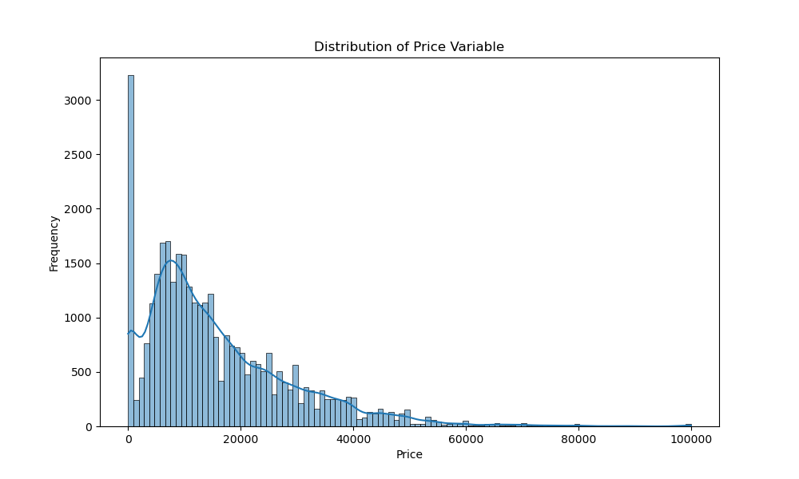

# Data-Driven Insights into what drives the price of a car

**Jupyter Notebook with code, experimentation, further insights, and deployment strategies:[here](https://github.com/genyngambia/Regression_Car_Price_Driver/blob/main/Regression_Car_Price_Driver/regression_car_price.ipynb).**

## Business Goal

Our objective is to analyze a dataset of used cars to identify the key factors that influence their prices. This involves converting categorical and numerical features into a format that suitable for modeling, handling missing data, and employing regression techniques to determine the relationship between car features and their prices. By performing feature selection and model evaluation, we aim to build a predictive model that can accurately estimate car prices based on their attributes, and provide actionable insights for the used car dealership to optimize the pricing strategy.

## Data

The dataset used in this project contains detailed information on 426,880 used car listings. Each listing includes various attributes that describe the car, such as its price, year of manufacture, manufacturer, model, condition, and odometer reading, among others. This rich dataset provides a comprehensive basis for analyzing factors that influence used car prices and for building predictive models.

### Dataset Structure

| Column Name    | Data Type | Description |
|----------------|-----------|-------------|
| id             | int64     | Unique identifier for each listing |
| region         | object    | Geographic region where the car is listed |
| price          | int64     | Price of the car in USD |
| year           | float64   | Year the car was manufactured |
| manufacturer   | object    | Manufacturer of the car |
| model          | object    | Model of the car |
| condition      | object    | Condition of the car (e.g., new, like new, excellent) |
| cylinders      | object    | Number of cylinders in the car's engine |
| fuel           | object    | Type of fuel the car uses (e.g., gasoline, diesel) |
| odometer       | float64   | Mileage of the car in miles |
| title_status   | object    | Title status of the car (e.g., clean, salvage) |
| transmission   | object    | Type of transmission (e.g., automatic, manual) |
| VIN            | object    | Vehicle Identification Number |
| drive          | object    | Type of drivetrain (e.g., 4wd, fwd, rwd) |
| size           | object    | Size category of the car (e.g., compact, mid-size) |
| type           | object    | Type of car (e.g., sedan, SUV, truck) |
| paint_color    | object    | Color of the car's paint |
| state          | object    | State where the car is listed |

## Modeling and performance

## Modeling and Performance

In this project, we employed various regression modeling techniques to predict car prices using a dataset of used car listings. The models evaluated include Linear Regression, Ridge Regression, and Lasso Regression. Each model was trained and evaluated using a train/test split, followed by cross-validation and hyperparameter tuning using GridSearchCV to optimize performance.

### Model Results

- **Linear Regression**:
  - **Root Mean Squared Error (RMSE)**: 2.10
  - **R-squared (R²)**: 0.417

- **Ridge Regression**:
  - **Best Parameters**: {'regressor__alpha': 1.0}
  - **Root Mean Squared Error (RMSE)**: 2.05
  - **R-squared (R²)**: 0.451

- **Lasso Regression**:
  - **Best Parameters**: {'regressor__alpha': 0.1}
  - **Root Mean Squared Error (RMSE)**: 2.72
  - **R-squared (R²)**: 0.0321

Among these, the Ridge Regression model demonstrated the best performance with a Root Mean Squared Error (RMSE) of 2.05 and an R-squared (R²) value of 0.451. This means that the model's predictions are off by about 2.05 units from the actual values of car prices, and approximately 45.14% of the variance in car prices is explained by the features in the model.

These metrics indicate that the Ridge Regression model provides a moderate level of accuracy in predicting car prices, making it the most suitable model for this dataset. The model's ability to perform feature selection through regularization helped in identifying the most significant predictors, thus enhancing interpretability and relevance.

### Conclusions

The Ridge Regression model revealed significant relationships between various features and car prices. Specifically, the car model, region, and state were among the most influential factors. These findings provide actionable insights for the used car dealership to better understand what consumers value in a used car.

#### Interesting Findings

| Feature          | Recommendation                                                                                  | Coefficient Value | Impact               | Interpretation                                                                                  |
|------------------|--------------------------------------------------------------------------------------------------|-------------------|----------------------|-------------------------------------------------------------------------------------------------|
| Model            | Stock popular and high-demand models.                                                            | 3003.680855       | Strong positive      | The specific model of the car has the most significant impact on its price.                     |
| Region           | Tailor pricing strategies to different regions based on local demand and preferences.            | 309.682128        | Positive             | The region where the car is sold significantly influences its price.                            |
| State            | Consider state-specific regulations and market conditions in pricing strategies.                 | 33.063745         | Positive             | The state of sale affects car prices, although to a lesser extent than the model and region.    |
| Manufacturer     | Focus on stocking cars from manufacturers that are in higher demand.                             | 12.908703         | Moderate positive    | The manufacturer has a moderate impact on car price.                                            |
| Type             | Diversify inventory to include various car types (e.g., sedan, SUV, truck) based on market trends.| 4.068798          | Positive             | The type of car has a noticeable impact on its price.                                           |
| Transmission     | Highlight cars with preferred transmission types (e.g., automatic vs. manual) in marketing.      | 3.903029          | Positive             | Transmission type slightly influences the car price.                                            |
| Cylinders        | Provide information on engine types and efficiency to attract specific buyer segments.           | 3.343972          | Positive             | The number of engine cylinders has a small positive impact on car price.                        |
| Condition        | Ensure detailed inspection and certification of car condition to justify higher pricing.         | 2.441059          | Positive             | The condition of the car plays a role in determining its price.                                 |
| Title Status     | Emphasize cars with clean titles in marketing efforts.                                            | 2.048118          | Positive             | The title status has a small impact on car price.                                               |
| Fuel             | Highlight fuel efficiency and alternative fuel options in marketing.                             | 1.222483          | Positive             | The type of fuel used has a minimal impact on car price.                                        |
| Paint Color      | Stock cars in popular colors and highlight unique color options.                                 | 1.196351          | Positive             | The paint color slightly influences car price.                                                  |
| Size             | Include a range of car sizes in inventory to meet diverse customer preferences.                  | 1.182219          | Positive             | The size category of the car has a minor impact on price.                                       |
| Odometer         | Emphasize low-mileage cars in promotions to justify higher prices.                               | 0.043222          | Very small positive  | The car's mileage has a very small positive impact on price.                                    |
| Drive            | Highlight the benefits of different drivetrain types (e.g., AWD, FWD) in marketing materials.    | 0.039563          | Very small positive  | The drivetrain type has a minimal impact on car price.                                          |
| Age              | Consider the age of the car in pricing strategies.                                               | 0.012932          | Very small positive  | The age of the car has a very small impact on price.                                            |
| Year             | Emphasize the model year in marketing materials.                                                 | 0.012932          | Very small positive  | The year of manufacture has a very small impact on price.                                       |

### Most Relevant Actionable Insights

- **Stock Popular Models:** Focus on stocking popular and high-demand car models to attract more buyers and justify higher prices.

- **Regional Pricing Strategies:** Tailor pricing strategies to different regions based on local demand and preferences to optimize sales.

- **State-Specific Considerations:** Take into account state-specific regulations and market conditions when setting prices.

- **Manufacturer Focus:** Stock cars from manufacturers that are in higher demand and have a reputation for reliability to appeal to consumers.

- **Diverse Car Types:** Offer a variety of car types (e.g., sedan, SUV, truck) to cater to different customer preferences and market trends.

